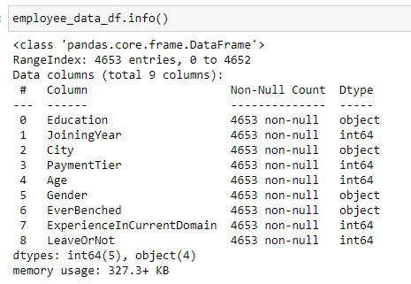

# ROSES

## Topic:

Employee Future Prediction

The topic of this project is to build a predictive model for determining if there is an association between expectations of an employee leaving within the next two years and a variety of predictor variables. 

## Description of the Data:
The dependent variable is a categorical variable of whether or not the employee is expected to be leaving or not within the next two years. The independent variables are employees level of education, year of joining the firm, city where office was located, tier of salary level, current age, gender of employee, whether or not the employee was kept out of projects for longer than one month, and length of experience in current field.

There is a total of 4,653 observations. Education level is a qualitative categorical variable consisting of three possible values: Bachelors, Masters, and Doctorate degrees. The year of joining firm variable is a continuous quantitative variable varies from 2012 to 2018. The city location of office is a qualitative categorical variable consisting of three cities: Bangalore, Pune, and New Delhi. The salary tier is a qualitative categorical variable which include three tiers: 1 for the highest, 2 for the middle, and 3 for the lowest. Age is a continuous quantitative variable ranging from 22 to 41. The gender variable is qualitative and categorical with either male or female. The qualitative categorical variable of whether or not the employee was kept out of projects for longer than one month is either yes or no. The experience length variable is continuous and quantitative and ranges from 0 to 7. The dependent variable being predicted of whether or not the employee is expected to be leaving the firm within two years is qualitative categorical variable of either 1 or 0 for yes or no.

[Database Properties](df_properties.PNG)

## Source:
The raw data is a CSV obtained from: 
[Data Source](https://www.kaggle.com/datasets/tejashvi14/employee-future-prediction)

The firm in question does not appear to be stated but can be noted to be located in India based on the office locations in Indian cities.

## Reasons to select the topic:
The reasoning behind this topic is to assist the firm's human resource department to improve its selection of future employees based on reasonably determined expectations of the longivity of their employment from known qualities of prospective applicants. Features of this model can then in turn may be useful for other firms as well for developing their workforce.

## Questions to be answered 
Which factors influence retention either remaining with a company, signified by 0, or leaves the company, signified by 1.

## Data Analysis 

### Database
To initiate the data analysis SQLlite will be used to create a database for analysis.

### Machine Learning Model: Balanced Random Forest Classifier 
  * Model Background 
    
    How does it work?
    
    Why this specific model?
    
    What is the model's accuracy?
    
    If there are statistics involved, what stats are being included in analysis and why?
    
    If no statistics are involved, what would you include if you had more time?
 
 * Overview of analysis  
    
    Connect to sqlite3 database
    
    Asses the properties of the database
    
    Establish columns/target and remove unwanted columns
    
    Check the balance of the target values
    
    Establish the training set and train the model
    
    Resample the training data
    
    Determine balanced accuracy score
    
    Calculate confusion matrix
    
    Calculate accuracy score
    
    Evaluate the imbalance classification report
    
    Determine the importance rating of each feature

