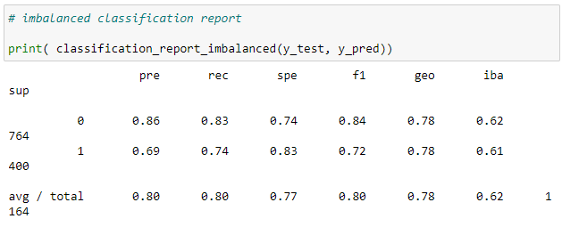

# ROSES

## Topic:  Employee Retention Prediction

The topic of this project is to build a predictive model for determining if there is an association between expectations of an employee leaving within the next two years and a variety of predictor variables. It was identified that the features 'Joining Year' (0.31) and ‘Age’ (0.19) are the main determinants of retention. 

### Topic Selection

The reasoning behind this topic is to assist the firm's human resource department to improve its selection of future employees based on reasonably determined expectations of the longevity of their employment from known qualities of prospective applicants. Features of this model can then in turn may be useful for other firms as well for developing their workforce.

### Questions to be answered 

Which factors influence employee retention? 

## Exploratory Analysis

### Data Source:

The raw data is a CSV obtained from: 
[Data Source](https://www.kaggle.com/datasets/tejashvi14/employee-future-prediction)

The firm in question does not appear to be stated but can be noted to be located in India based on the office locations in Indian cities.

### Data Overview

The dependent variable is a categorical variable of whether or not the employee is expected to be leaving or not within the next two years. The independent variables are employees level of education, year of joining the firm, city where office was located, tier of salary level, current age, gender of employee, whether or not the employee was kept out of projects for longer than one month, and length of experience in current field.

There is a total of 4,653 observations. Education level is a qualitative categorical variable consisting of three possible values: Bachelors, Masters, and Doctorate degrees. The year of joining firm variable is a continuous quantitative variable varies from 2012 to 2018. The city location of office is a qualitative categorical variable consisting of three cities: Bangalore, Pune, and New Delhi. The salary tier is a qualitative categorical variable which include three tiers: 1 for the highest, 2 for the middle, and 3 for the lowest. Age is a continuous quantitative variable ranging from 22 to 41. The gender variable is qualitative and categorical with either male or female. The qualitative categorical variable of whether or not the employee was kept out of projects for longer than one month is either yes or no. The experience length variable is continuous and quantitative and ranges from 0 to 7. The dependent variable being predicted of whether or not the employee is expected to be leaving the firm within two years is qualitative categorical variable of either 1 or 0 for yes or no.

Database Properties

Population Overview

## Database

Python Pandas was used to generate SQlite3 database “employees_df.db”  from the csv file “Employee.csv". First, the csv file was read into the DataFrame  “EmployeeIndex” with an added index to serve as primary key. The employees dataframe was used to generate two independent tables. One table called “Predicated” containing the target variable ‘LeaveOrNot’ and the reference index. . The second table called “Features”  containing the variables 'Education', 'JoiningYear', 'City', 'PaymentTier', 'Age', 'Gender', 'EverBenched', ‘ExperienceInCurrentDomain’ and the reference index. These tables were joined using SQlite3 into the table “Employees”, and loaded into the dataframe “employee_data_df”. Then the reference index was removed. The table contained no null values. 

### Machine Learning Model: Balanced Random Forest Classifier 

####  Model Background 

Random Forest model uses multiple decision trees to process the data to arrive to a more accurate prediction of the target value from the given features. It is a highly accurate model that compensates for overfitting by using the average of all predictions and most importantly it allows determination of the features with the most influence on the target.

XXXXXXX If there are statistics involved, what stats are being included in analysis and why?

XXXXXXX If no statistics are involved, what would you include if you had more time?

#### Overview of analysis

Connect to sqlite3 database via pd.read_sql_query

Asses the properties of the database  to determine the size and integrity of the database. there were no null values identified. 

Establish columns/target  and remove unwanted columns: The variables within the dataframe “employee-data_df” were subsequently split into dependent variables (features) and labels (target). Then, string values were converted into numerical values using the code pd.get_dummies.  

Check the balance of the target values

Establish the training set and train the model: and split into test/training sets using sklearn.model_selection import train_test_split.  

Resample the training data

Determine balanced accuracy score and calculate confusion matrix: The training data was then resampled using the BalancedRandomForestClassifier and the balance accuracy score and confusion matrix were calculated.

Accuracy Score

Confusion Matrix

Evaluate the imbalance classification report

Classification report

Determine the importance rating of each feature

Feature importance

#### Dashboard

[Tableau: Overview of Database](https://public.tableau.com/views/Overview_16731458673560/OVERVIEW_1?:language=en-US&:display_count=n&:origin=viz_share_link)

[Tableau: Retention Analysis](https://public.tableau.com/views/Retention_16732215158480/Retention?:language=en-US&:display_count=n&:origin=viz_share_link)

[Storyboard: Google Slides Deck](https://docs.google.com/presentation/d/1MwUGWD0oV54u0reO5Xjkq1sKSW_22-Wau55gW6GMRZY/edit?usp=sharing)

## Hindsight 20/20

More robust database
